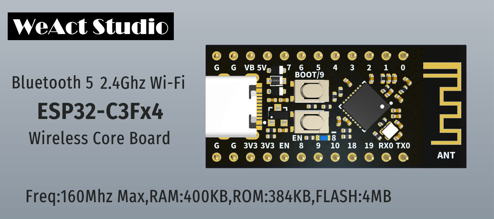

* [English version](./README.md)
# WeActStudio.ESP32C3CoreBoard

ESP32-C3FH4
> 160Mhz Max,400KB RAM,384KB ROM,4MB FLASH

乐鑫 官方网站 www.espressif.com.cn

|目录名称|内容|
| :--:|:--:|
|Doc| 数据手册/参考手册|
|Hardware| 硬件开发资料|
|Examples|软件例程|
|Tools|工具|

## 如何下载程序
方法
1. 解压`Tools`目录下的`esptool-v4.2.1-win64_WeActStudio.zip`
2. 运行`WeAct Studio UART Download Tool.bat`
3. 按住BOOT键然后用USB数据线连接电脑，释放BOOT键
4. 拖入需要烧录的程序，输入烧录地址以及串口号，点击回车开始烧录

## ESP-IDF 使用注意事项
1. 程序不断复位时，需要进入烧录模式方可正常下载
2. 软件工程需要设置UART打印为`USB Serial/Debug`
3. TBD

```
/*---------------------------------------
- WeAct Studio Official Link
- taobao: weactstudio.taobao.com
- aliexpress: weactstudio.aliexpress.com
- github: github.com/WeActTC
- gitee: gitee.com/WeAct-TC
- blog: www.weact-tc.cn
---------------------------------------*/
```